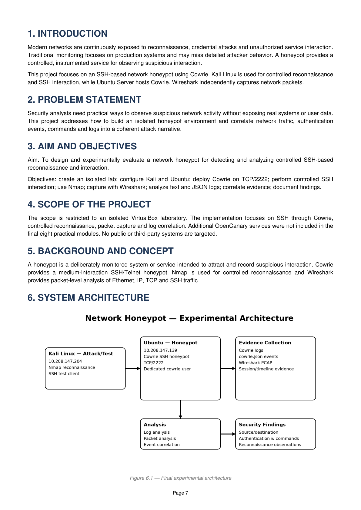
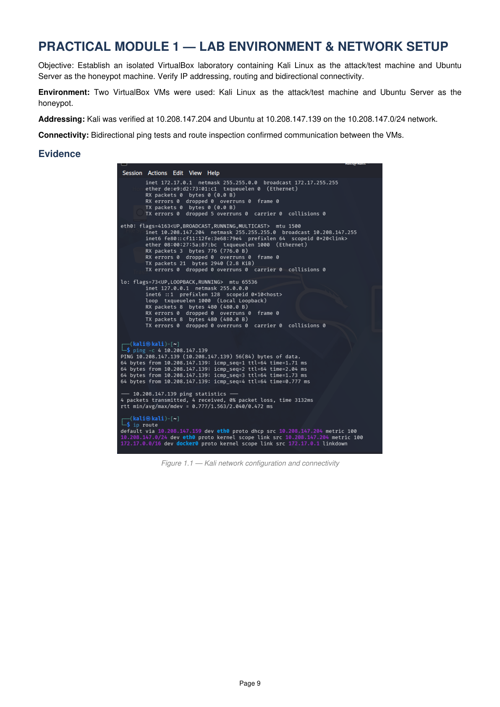
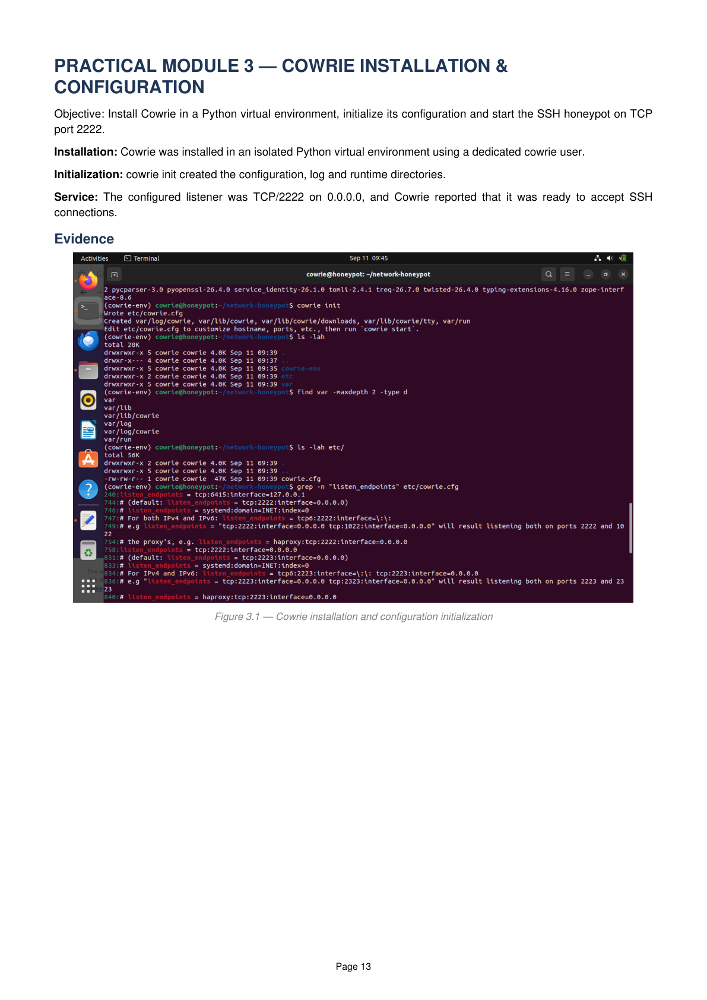
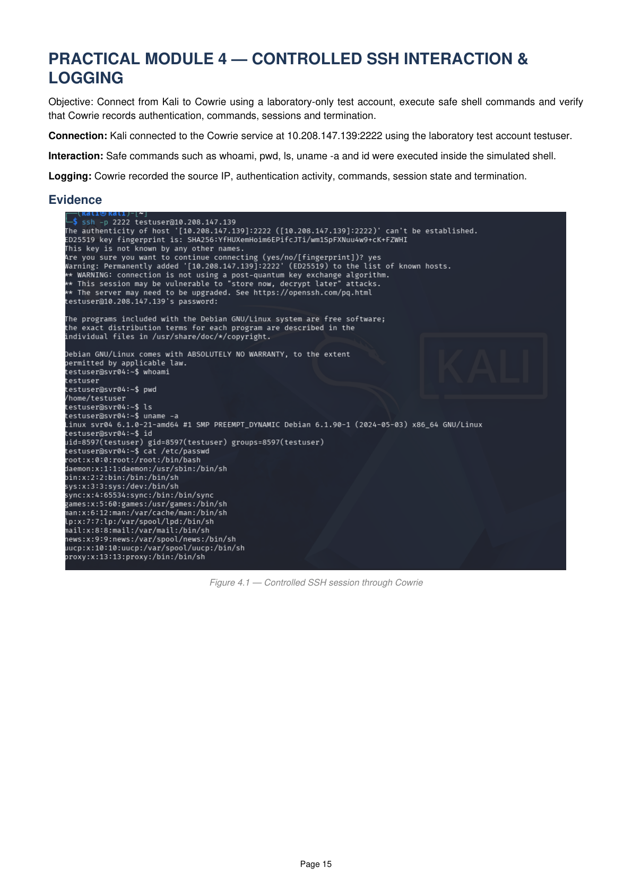
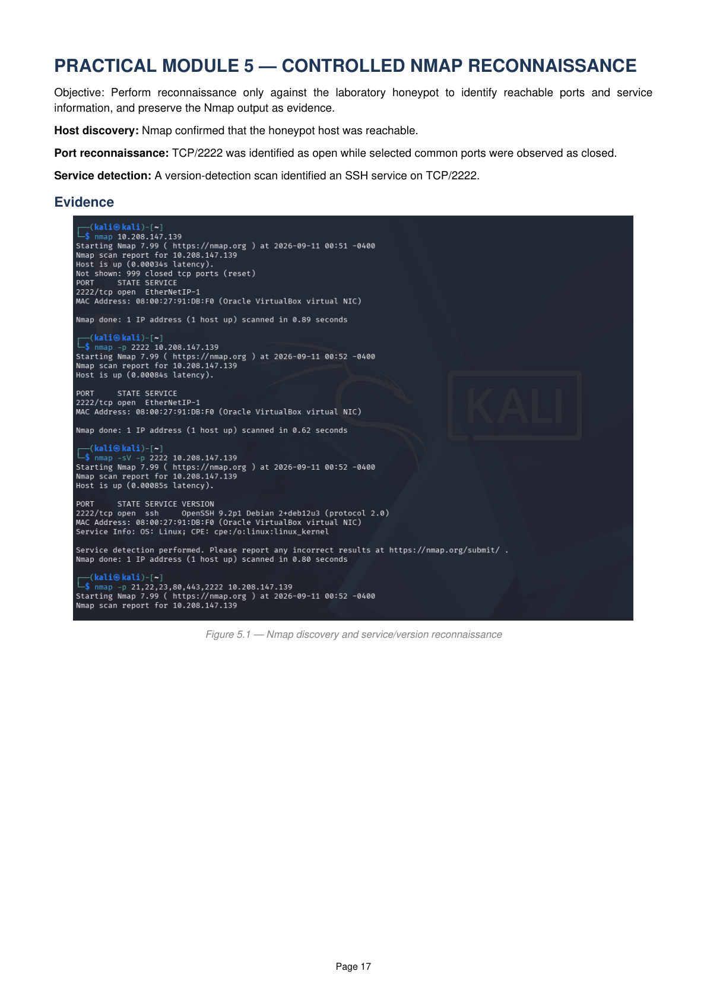
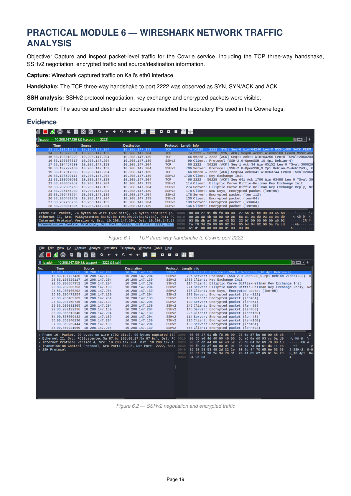
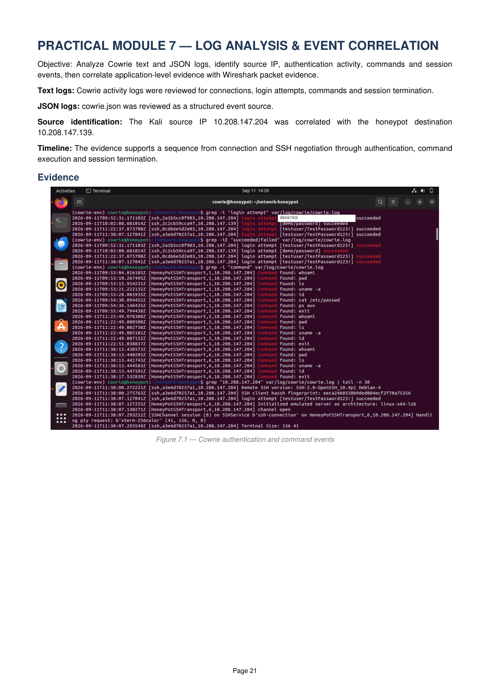

# 🛡️ Network Honeypot for Attack Detection and Network Traffic Analysis

<p align="center">
  <strong>A Practical Cybersecurity Experiment for Controlled SSH Attack Detection, Network Traffic Analysis and Evidence Correlation</strong>
</p>

---

## 📌 Project Overview

This project implements a practical network honeypot laboratory designed to
observe and analyze controlled suspicious network activity in an isolated
environment.

The laboratory uses:

- 🐉 Kali Linux as the attack/test machine
- 🐧 Ubuntu Server as the honeypot host
- 🪤 Cowrie as the SSH honeypot
- 🔎 Nmap for controlled reconnaissance
- 🦈 Wireshark for packet-level network traffic analysis

Cowrie was configured to provide an SSH honeypot on TCP port `2222`.
The experiment combines Cowrie application/session logs with Wireshark
packet-level evidence to construct a coherent sequence of network activity.

> ⚠️ **Safety Notice:** This project was performed only in an isolated
> academic laboratory using project-owned virtual machines and laboratory
> test credentials. No public or third-party systems were targeted.

---

## 🎯 Aim

To design and experimentally evaluate a network honeypot for detecting and
analyzing controlled SSH-based reconnaissance and interaction.

---

## 🎯 Objectives

- Establish an isolated cybersecurity laboratory
- Configure Kali Linux and Ubuntu Server
- Deploy Cowrie as an SSH honeypot
- Monitor controlled SSH interaction
- Perform controlled Nmap reconnaissance
- Capture network traffic using Wireshark
- Analyze Cowrie text and JSON logs
- Correlate application-level and packet-level evidence
- Document security observations and findings

---

## 🏗️ Experimental Architecture

```text
┌─────────────────────┐
│   Kali Linux        │
│   Attack / Test     │
│                     │
│   Nmap              │
│   SSH Interaction   │
└──────────┬──────────┘
           │
           │ Controlled Network Activity
           ▼
┌─────────────────────┐
│   Ubuntu Server     │
│   Honeypot Host     │
│                     │
│   Cowrie SSH        │
│   TCP / 2222        │
└──────────┬──────────┘
           │
           ├──────────────────────┐
           ▼                      ▼
┌─────────────────────┐   ┌─────────────────────┐
│   Cowrie Logs       │   │   Wireshark         │
│                     │   │                     │
│ Authentication      │   │ TCP Handshake       │
│ Commands            │   │ SSHv2 Negotiation   │
│ Sessions             │   │ Encrypted Traffic   │
│ Source IP            │   │ Network Details    │
└──────────┬──────────┘   └──────────┬──────────┘
           │                         │
           └──────────┬──────────────┘
                      ▼
             ┌─────────────────┐
             │ Evidence        │
             │ Correlation     │
             │                 │
             │ Attack Timeline │
             │ Security        │
             │ Findings        │
             └─────────────────┘
```
---

## 🖥️ Lab Environment

| Component | Details |
|---|---|
| Kali Linux | Attack / Test Machine |
| Ubuntu Server | Honeypot Host |
| Cowrie | SSH Honeypot |
| Cowrie Port | `2222` |
| Network | Isolated Virtual Lab |

---
---

## 🛠️ Tools & Technologies

- 🐉 **Kali Linux** — Attack / Test Machine
- 🐧 **Ubuntu Server** — Honeypot Host
- 🪤 **Cowrie** — SSH Honeypot
- 🔎 **Nmap** — Network Reconnaissance
- 🦈 **Wireshark** — Network Traffic Analysis
- 🐍 **Python 3** — Environment and Supporting Tasks
- 📦 **VirtualBox** — Virtualized Laboratory Environment
---
---

## 📚 Project Modules

### Module 1 — Isolated Lab Setup
Configured an isolated VirtualBox laboratory with Kali Linux and Ubuntu Server.

### Module 2 — Network Configuration
Configured and verified communication between the Kali Linux attack/test machine and Ubuntu honeypot host.

### Module 3 — Cowrie SSH Honeypot
Deployed and configured Cowrie as an SSH honeypot listening on TCP port `2222`.

### Module 4 — SSH Interaction
Performed controlled SSH interaction using laboratory test credentials and safe commands.

### Module 5 — Network Reconnaissance
Used Nmap for controlled host discovery, port scanning, and service/version detection.

### Module 6 — Network Traffic Analysis
Used Wireshark to observe TCP connection establishment, SSHv2 negotiation, key exchange, and encrypted traffic.

### Module 7 — Log Analysis
Analyzed Cowrie text and JSON logs containing authentication attempts, commands, sessions, and source information.

### Module 8 — Evidence Correlation
Correlated Cowrie logs with Wireshark packet evidence to construct an attack/activity timeline and identify security findings.

---

---

## 🔄 Attack / Activity Sequence

```text
START
  │
  ▼
Kali Linux
Attack / Test Machine
  │
  │ 1. Reconnaissance
  ▼
Nmap Scan
  │
  │ 2. TCP Connection to Port 2222
  ▼
Ubuntu Server
Cowrie SSH Honeypot
  │
  │ 3. SSHv2 Negotiation
  │ 4. Authentication
  │ 5. Interactive Commands
  ▼
Cowrie Logs + Wireshark
  │
  │ 6. Evidence Correlation
  ▼
Attack Timeline
  │
  │ 7. Security Analysis
  ▼
Security Findings
  │
  ▼
END
```
🔍 Evidence Sources
| Evidence Source | Observed Information                                            |
| --------------- | --------------------------------------------------------------- |
| **Nmap**        | Host discovery, open port, service detection                    |
| **Cowrie**      | Authentication attempts, commands, sessions, source information |
| **Wireshark**   | TCP handshake, SSHv2 negotiation, encrypted traffic             |
| **Correlation** | Activity timeline and security findings                         |

---
---

## 📸 Project Evidence

The following screenshots document the practical execution and analysis performed in the isolated laboratory.

### 1️⃣ Experimental Architecture



### 2️⃣ Lab Setup



### 3️⃣ Cowrie SSH Honeypot



### 4️⃣ SSH Interaction



### 5️⃣ Nmap Reconnaissance



### 6️⃣ Wireshark Traffic Analysis



### 7️⃣ Cowrie Log Analysis



---

---

## 🔎 Key Findings

- ✅ Network reachability between the laboratory systems was successfully verified.
- ✅ Cowrie was successfully deployed as an SSH honeypot on TCP port `2222`.
- ✅ Controlled SSH authentication activity was recorded by Cowrie.
- ✅ Interactive commands and session activity were captured in Cowrie logs.
- ✅ Nmap identified the exposed SSH service on TCP port `2222`.
- ✅ Wireshark captured the TCP three-way handshake and SSHv2 negotiation.
- ✅ Encrypted SSH traffic was observed at the packet level.
- ✅ Cowrie logs and Wireshark captures were correlated to reconstruct the activity timeline.
- ✅ The experiment demonstrated how multiple evidence sources can provide complementary visibility into suspicious network activity.
---
---

## ⚠️ Limitations

- The experiment was conducted only in an isolated academic laboratory.
- The analysis focused primarily on SSH-based network activity.
- The command set used for interaction was intentionally small and safe.
- The laboratory used private IP addresses and test credentials.
- Encrypted SSH contents could not be directly inspected at the application-data level.
- OpenCanary and additional honeypot protocols were not included in the final implementation.
---
---

## 🚀 Future Scope

- 🔹 Integrate additional honeypot services and protocols such as OpenCanary.
- 🔹 Integrate the collected logs with SIEM platforms such as Splunk or ELK.
- 🔹 Develop automated security alerts for suspicious activity.
- 🔹 Build dashboards for visualizing honeypot events and network activity.
- 🔹 Improve centralized log storage and event correlation.
- 🔹 Deploy multiple honeypot nodes for broader monitoring.
- 🔹 Conduct additional controlled security research in an isolated environment.
---
---

## 🏁 Conclusion

This project successfully demonstrated the use of a network honeypot for
controlled SSH attack detection and network traffic analysis in an isolated
laboratory environment.

Cowrie captured SSH authentication and shell activity, while Wireshark
provided packet-level network evidence. Correlating these evidence sources
helped reconstruct the sequence of network activity and identify relevant
security findings.

The experiment demonstrates how honeypots and network traffic analysis can
provide useful defensive visibility into suspicious network behavior.

---
---

## 📄 Project Report

For detailed methodology, experimental procedures, results, limitations, and
references, see the complete project report:

📥 **[View Project Report](docs/project-report.pdf)**

---
---

## 👨‍💻 Author

**Chavali Keshava Gopalu**

🎯 Cybersecurity Enthusiast | SOC Analyst Aspirant

🔗 **LinkedIn:** https://www.linkedin.com/in/chavali-keshava-gopalu-3562ab26a

🐙 **GitHub:** https://github.com/Kesav3107

---
